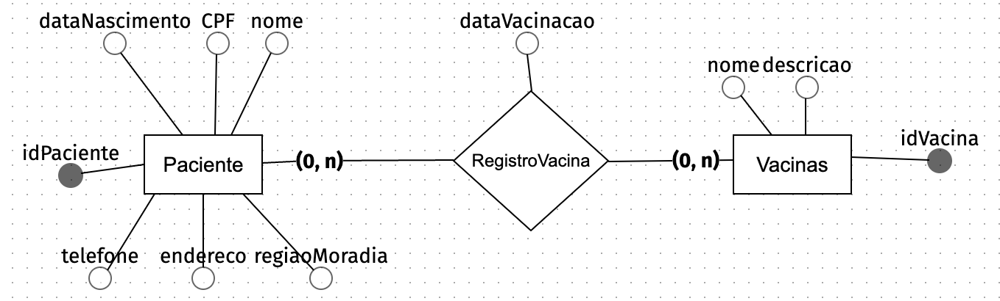

### Banco de Dados SQL com PostgreSQL 

<p>Neste projeto, utilizei o PostgreSQL como sistema de gerenciamento de banco de dados, mas você pode usar qualquer outro desde que o resultado seja um banco de dados relacional. Dependendo da sua escolha, pode ser que os comandos SQL tenham algumas mudanças. Além disso, eu resolvi usar o Postico para realizar as operações de criar e editar minhas tabelas.</p> 
<p>Em resumo, o PostgreSQL é o próprio sistema de gerenciamento de banco de dados, enquanto o Postico é uma ferramenta que permite aos usuários interagir com o PostgreSQL por meio de uma interface gráfica amigável.</p>


### Modelagens: Diagramas do Banco de dados

<h5>Modelagem Conceitual:</h5>


<h5>Modelagem Lógica:</h5>


### Backup em SQL do banco de dados

```sql
-- Paciente ----------------------------------------------
CREATE TABLE paciente (
    telefone character varying(11),
    cpf character(11) NOT NULL UNIQUE,
    nome character varying(100) NOT NULL,
    endereco character varying(300) NOT NULL,
    regiaomoradia character varying(100) NOT NULL,

    idpaciente SERIAL PRIMARY KEY,
    datanascimento date
);
CREATE UNIQUE INDEX paciente_pkey ON paciente(idpaciente int4_ops);
CREATE UNIQUE INDEX paciente_cpf_key ON paciente(cpf bpchar_ops);

-- Vacinas ----------------------------------------------

CREATE TABLE vacinas (
    idvacina SERIAL PRIMARY KEY,
    descricao character varying(500),
    nome character varying(150) NOT NULL UNIQUE
);
CREATE UNIQUE INDEX vacinas_pkey ON vacinas(idvacina int4_ops);
CREATE UNIQUE INDEX vacinas_nome_key ON vacinas(nome text_ops);

-- RegistroVacina ----------------------------------------------

CREATE TABLE registrovacina (
    idvacina integer REFERENCES vacinas(idvacina),
    idpaciente integer REFERENCES paciente(idpaciente),
    datavacinacao date,
    CONSTRAINT registrovacina_pkey PRIMARY KEY (idvacina, idpaciente)
);
CREATE UNIQUE INDEX registrovacina_pkey ON registrovacina(idvacina int4_ops,idpaciente int4_ops);
```


### Dados de Exemplo

```sql
-- Dados de pacientes
INSERT INTO public.paciente (telefone, cpf, nome, endereco, regiaomoradia, idpaciente, datanascimento) VALUES ('11999999999', '12345678901', 'Ana B. Castro', 'Av. Paulista, 234', 'Sudeste', 1, '2000-01-15');
INSERT INTO public.paciente (telefone, cpf, nome, endereco, regiaomoradia, idpaciente, datanascimento) VALUES ('47999999999', '23456781234', 'Joana Darc', 'rua. 1001, casa2, Balneário Camburiú', 'Sul', 2, '1963-10-15');
INSERT INTO public.paciente (telefone, cpf, nome, endereco, regiaomoradia, idpaciente, datanascimento) VALUES ('6212345678', '98765432187', 'Alex', 'Alameda Contorno, 1234, Goiânia', 'Centro-oeste', 3, '2004-01-01');
INSERT INTO public.paciente (telefone, cpf, nome, endereco, regiaomoradia, idpaciente, datanascimento) VALUES ('92347638938', '62966662666', 'Rick Sanches', 'Av. Seatle, 9876', 'Norte', 4, '1963-08-10');

-- Vacinas
INSERT INTO public.vacinas (idvacina, descricao, nome) VALUES (3, 'Combate o virus da Hepatite B', 'Hepatite B');
INSERT INTO public.vacinas (idvacina, descricao, nome) VALUES (4, 'Combate Hepatite C', 'Hepatite C');
INSERT INTO public.vacinas (idvacina, descricao, nome) VALUES (5, 'previne a febre amarela - dose unica', 'Febre Amarela');
INSERT INTO public.vacinas (idvacina, descricao, nome) VALUES (6, 'previne Influenza - uma dose anual', 'Influenza');
INSERT INTO public.vacinas (idvacina, descricao, nome) VALUES (7, 'estimula o sistema imun. a produzir anticorpos e células de defesa contra o vírus SARS-CoV-2', 'Covid-19 ');
INSERT INTO public.vacinas (idvacina, descricao, nome) VALUES (1, 'Combate o virus da Hepatite A', 'Hepatite A');
INSERT INTO public.vacinas (idvacina, descricao, nome) VALUES (9, 'Estimula o sistema imune contra a Sarampo', 'Anti-Sarampo');

-- Registro vacinas
INSERT INTO public.registrovacina (idvacina, idpaciente, datavacinacao) VALUES (6, 1, '2022-09-20');
INSERT INTO public.registrovacina (idvacina, idpaciente, datavacinacao) VALUES (6, 4, '2022-09-20');
INSERT INTO public.registrovacina (idvacina, idpaciente, datavacinacao) VALUES (7, 1, '2019-08-15');
INSERT INTO public.registrovacina (idvacina, idpaciente, datavacinacao) VALUES (7, 4, '2023-06-02');


```
